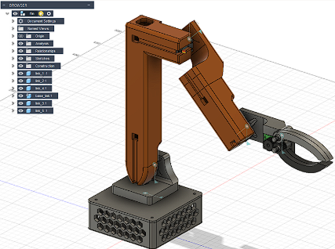
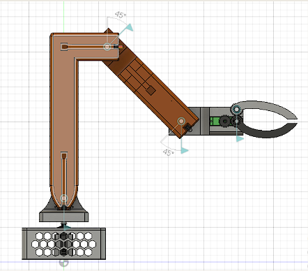
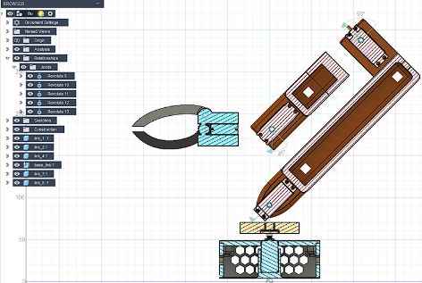

# Fusion 360 Modeling

## Overview
The 5-DOF robotic arm was fully designed and assembled in **Autodesk Fusion 360** to validate geometry, joint layout, and manufacturability before simulation and hardware implementation.

**Fusion 360 CAD Model:** [Download robo-arm.f3d](../STEP/robo-arm.f3d) - Complete 3D assembly file with all components and joints.

**URDF Robot Description:** [View URDF](../urdf/urdf/Untitled.urdf) - Robot description file exported from Fusion 360 for simulation.

  

*Figure 1: Complete robotic arm assembly in Fusion 360*

  

*Figure 2: Joint configuration and kinematic chain*

  

*Figure 3: Individual link components and servo mounting*

---

## Design Characteristics
- 5-DOF servo-driven mechanical structure  
- Designed around **MG996R servo motors**  
- Compact link geometry to reduce torque load  
- Modular parts for easy replacement  
- Suitable for URDF export and simulation  

---

## Mechanical Structure
The arm consists of:
- Base rotation
- Shoulder
- Elbow
- Wrist
- Servo-driven gripper

Each link is modeled as a separate component and connected using rotational joints that match real servo axes.

---

## Assembly and Joints
- Components assembled using Fusion 360 joint constraints  
- Joint limits aligned with servo motion range  
- Assembly hierarchy matches the kinematic chain  

This allows direct mapping between CAD, URDF, IK model, and simulation.

---

## Geometry Optimization
- Reduced lever arms where possible  
- Weight reduction via internal cutouts  
- Reinforced joint regions for load handling  

---

## 3D Printing
- Designed for FDM 3D printing  
- Clearances for screws and servo mounts  
- Modular printable components  

---

## Project Role
The Fusion 360 model is the mechanical reference for:
- URDF robot description  
- Inverse kinematics implementation  
- NVIDIA Isaac Sim digital twin  

---

## Future Improvements
- Weight reduction  
- Gripper refinement  
- Cable routing
