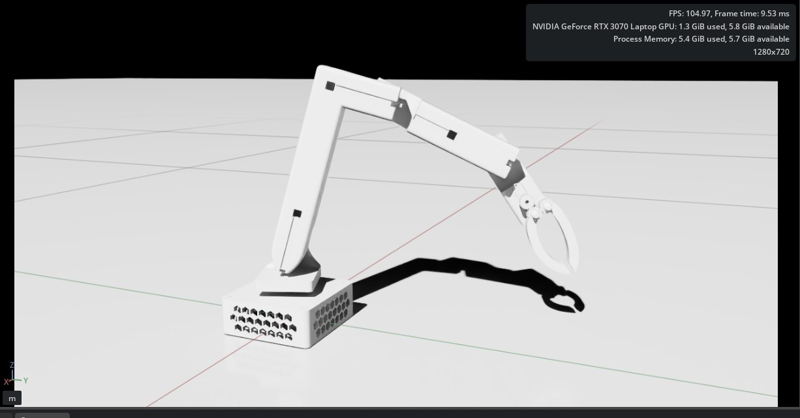
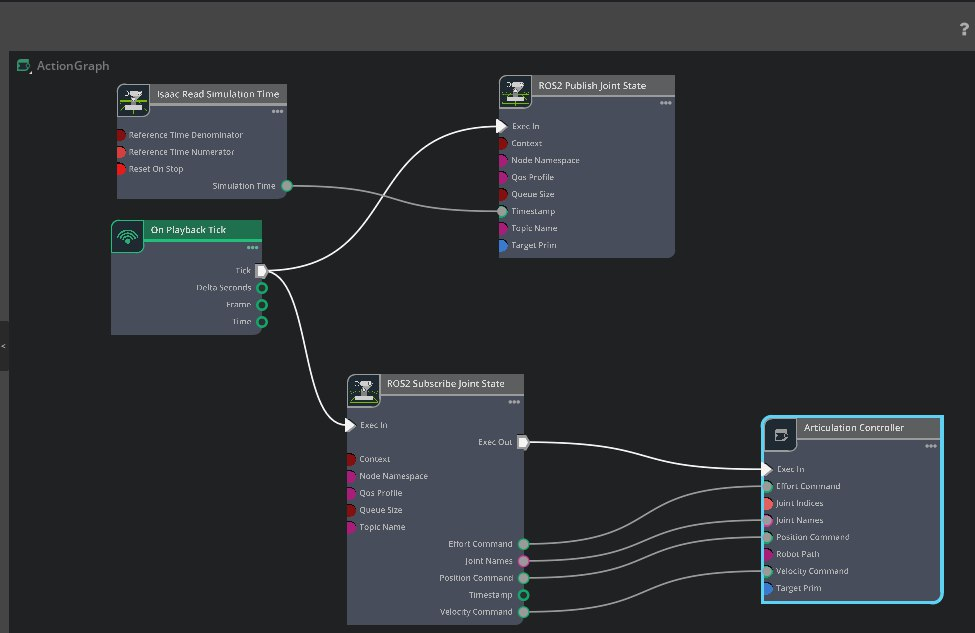

# Isaac Sim Integration

## Overview
The robot is simulated in **NVIDIA Isaac Sim** using a URDF model generated from the Fusion 360 design.

  

 

---

## URDF
- Matches mechanical structure
- Correct joint axes and limits
- Used as the simulation base model

---

## Control
- Isaac Sim **Action Graph**
- ROS2 communication

  

**Data flow:**
1. Target joint values received from ROS2 / micro-ROS
2. Joint positions applied in simulation
3. Current joint states published to `/joint_states`

---

## Digital Twin
The same kinematic model and joint configuration are used for:
- Simulation in Isaac Sim
- Control logic
- Real hardware execution

This ensures consistent behavior between simulation and the physical robot.

---

  

## micro-ROS
- ESP32 communicates via **micro-ROS**
- Hardware publishes joint commands to ROS2
- Isaac Sim subscribes to the same topics

---

## Purpose
- Validate inverse kinematics
- Test motion before hardware
- Digital twin verification
