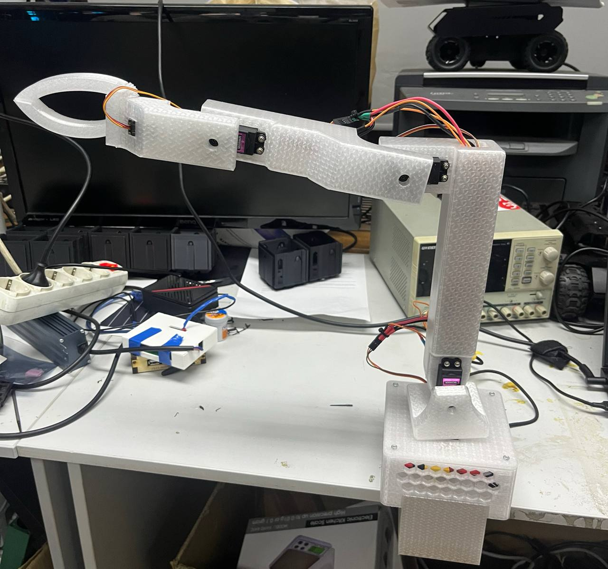

# 3d Printed 5DOF robotic arm + Isaac-Simulator integration + inverse kinematics
A 3D-printed 5-DOF robotic manipulator designed, built, and simulated from scratch. The project combines mechanical design, inverse kinematics, and digital-twin simulation using NVIDIA Isaac Sim.


<p align="center">
  
</p>


## Key Features

1) Fully 3D printed

2) Designed in Fusion 360

3) Inverse Kinematics implementation (Python ikpy library, ROS2)

4) URDF model for simulation

5) Integrated with Isaac Sim for realistic physics and motion testing

6) Digital twin: same kinematics for simulation and real hardware


## Demo
- Isaac Sim + Inverse Kinematics 

<p align="center">
  
</p>

- Digital twin  

<p align="center">
  
</p>  


## Technical Stack
- Python
- NVIDIA Isaac Sim
- URDF
- IKPy
- Fusion 360
- ESP32, MG996R


## Project Structure
```text
├── 0-docs/      # Documentation
├── urdf/        # Robot description files
├── src/         # Inverse kinematics & control scripts
├── images/      # Images for README
├── media/       # GIFs
└── README.md
```


## Inverse Kinematics
The robotic arm uses inverse kinematics to compute joint angles from a target end-effector position.
The IK solution is implemented in Python using the IKPy library and validated in NVIDIA Isaac Sim.


## Simulation & Digital Twin
The robot is simulated in NVIDIA Isaac Sim using a URDF model.
The same kinematic model is used for both simulation and real hardware, enabling a digital twin workflow.


